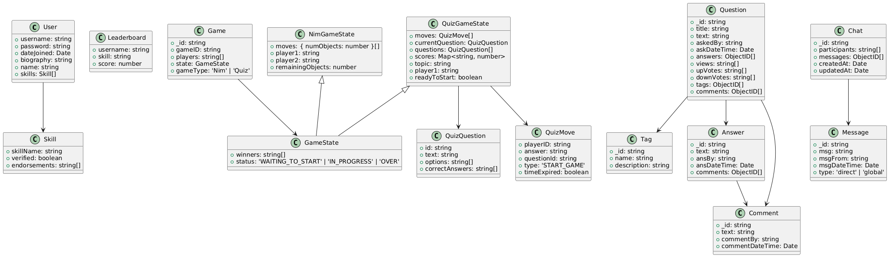

## Instructions to run

1. Run `npm install` in the root directory to install all dependencies for the `client`, `server`, and `shared` folders.
2. Run `npm run populate-db` in the server directory
3. Create a .env file in the server directory
   
    3.1 The env file should look something like this
    ```
    MONGODB_URI=Create your own MongoDB Atlas database and use its connection string
    CLIENT_URL=http://localhost:3000
    PORT=8000
    QUIZ_API_KEY=API key for `https://quizapi.io/`
    ```

4. Create a .env file in the client directory

    4.1 The env file should look something like this
    ```
    REACT_APP_SERVER_URL=http://localhost:8000
    REACT_APP_GOOGLE_CLIENT_ID=Create your own Google OAuth Client ID via Google Cloud Console
    ```
6. Run `npm run start` in both the `client` and `server` directories, use different terminals
7. Open `https://localhost:3000/` in a browser

## Codebase Folder Structure

- `client`: Contains the frontend application code, responsible for the user interface and interacting with the backend. This directory includes all React components and related assets.
- `server`: Contains the backend application code, handling the logic, APIs, and database interactions. It serves requests from the client and processes data accordingly.
- `shared`: Contains all shared type definitions that are used by both the client and server. This helps maintain consistency and reduces duplication of code between the two folders. The type definitions are imported and shared within each folder's `types/types.ts` file.

## Database Architecture

The schemas for the database are documented in the directory `server/models/schema`.
A class diagram for the schema definition is shown below:



## API Routes

### `/answer`

| Endpoint   | Method | Description      |
| ---------- | ------ | ---------------- |
| /addAnswer | POST   | Add a new answer |

### `/comment`

| Endpoint    | Method | Description       |
| ----------- | ------ | ----------------- |
| /addComment | POST   | Add a new comment |

### `/messaging`

| Endpoint     | Method | Description           |
| ------------ | ------ | --------------------- |
| /addMessage  | POST   | Add a new message     |
| /getMessages | GET    | Retrieve all messages |

### `/question`

| Endpoint          | Method | Description                     |
| ----------------- | ------ | ------------------------------- |
| /getQuestion      | GET    | Fetch questions by filter       |
| /getQuestionById/ | GET    | Fetch a specific question by ID |
| /addQuestion      | POST   | Add a new question              |
| /upvoteQuestion   | POST   | Upvote a question               |
| /downvoteQuestion | POST   | Downvote a question             |

### `/tag`

| Endpoint                   | Method | Description                                   |
| -------------------------- | ------ | --------------------------------------------- |
| /getTagsWithQuestionNumber | GET    | Fetch tags along with the number of questions |
| /getTagByName/             | GET    | Fetch a specific tag by name                  |

### `/user`
| Endpoint                  | Method | Description                                      |
| ------------------------- | ------ | ------------------------------------------------ |
| /signup                   | POST   | Create a new user account                        |
| /login                    | POST   | Log in as a user                                 |
| /verifyGoogleToken        | POST   | Verify Google OAuth token                        |
| /resetPassword            | PATCH  | Reset user password                              |
| /getUser/:username        | GET    | Fetch user details by username                   |
| /getUsers                 | GET    | Fetch all users                                  |
| /deleteUser/:username     | DELETE | Delete a user by username                        |
| /updateBiography          | PATCH  | Update user biography                            |
| /updateDisplayName        | PATCH  | Update user display name                         |
| /addSkillToProfile        | PATCH  | Add a skill to user profile                      |
| /verifySkill              | PATCH  | Verify a skill on a user's profile               |
| /removeSkillFromProfile   | PATCH  | Remove a skill from user profile                 |
| /addEndorsementToSkill    | PATCH  | Endorse a skill for a user                       |
| /githubAuth               | GET    | Initiate GitHub OAuth login                      |
| /githubCallback           | GET    | Handle GitHub OAuth callback                     |

### `/skill`
| Endpoint     | Method | Description               |
| ------------ | ------ | ------------------------- |
| /getSkills   | GET    | Retrieve list of all skills |

### `/leaderboard`
| Endpoint              | Method | Description                                  |
| --------------------- | ------ | -------------------------------------------- |
| /updateLeaderboard    | POST   | Update or create a leaderboard entry         |
| /getLeaderboard/:skill| GET    | Get top scores for a specific skill          |


### `/chat`

| Endpoint                    | Method | Description                                                                 |
| --------------------------- | ------ | --------------------------------------------------------------------------- |
| `/createChat`               | POST   | Create a new chat.                                                          |
| `/:chatId/addMessage`       | POST   | Add a new message to an existing chat.                                      |
| `/:chatId`                  | GET    | Retrieve a chat by its ID, optionally populating participants and messages. |
| `/:chatId/addParticipant`   | POST   | Add a new participant to an existing chat.                                  |
| `/getChatsByUser/:username` | GET    | Retrieve all chats for a specific user based on their username.             |

### `/games`
| Endpoint           | Method | Description                                           |
| ------------------ | ------ | ----------------------------------------------------- |
| /create            | POST   | Create a new game                                     |
| /join              | POST   | Join an existing game                                |
| /leave             | POST   | Leave a game                                          |
| /games             | GET    | Retrieve all games                                    |
| /getMCQuestion     | POST   | Fetch a multiple choice question (Quiz game only)     |

## Running Stryker Mutation Testing

Mutation testing helps you measure the effectiveness of your tests by introducing small changes (mutations) to your code and checking if your tests catch them. To run mutation testing with Stryker, use the following command in `server/`:

```sh
npm run stryker
```

{ : .note } In case you face an "out of memory" error while running Stryker, use the following command to increase the memory allocation to 4GB for Node.js:

```sh
node --max-old-space-size=4096 ./node_modules/.bin/stryker run
```
